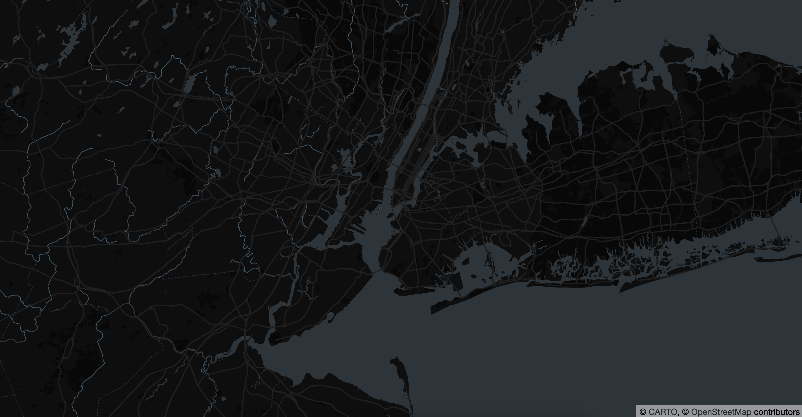

# Module 01: Introduction to Deck.GL

## Import package

```javascript
import DeckGL from '@deck.gl/react';
```

## Add `react-map-gl` (with `maplibre-gl`)

```javascript
import { Map } from 'react-map-gl/maplibre';
```

## Import `MAP_DARK_STYLE` url from `../src/enums`

```javascript
import { MAP_DARK_STYLE } from '../src/enums';
```

## Add initial view state

```javascript
// This will set the map view to New York.
const INITIAL_VIEW_STATE = {
  longitude: -74,
  latitude: 40.7,
  zoom: 10,
  maxZoom: 16,
};
```

## Add `deck.gl` component

```javascript
<DeckGL initialViewState={ADD_PROPS}>
  {/* TODO: Add `react-map-gl` component */}
</DeckGL>
```

## Add `react-map-gl` component

```javascript
<Map mapStyle={ADD_PROPS}></Map>
```

## Add `props` to all the component (replace ADD_PROPS) to the value

```javascript
<DeckGL initialViewState={INITIAL_VIEW_STATE}>
  <Map mapStyle={MAP_DARK_STYLE}></Map>
</DeckGL>
```

## Result

Your page should look something like this:

