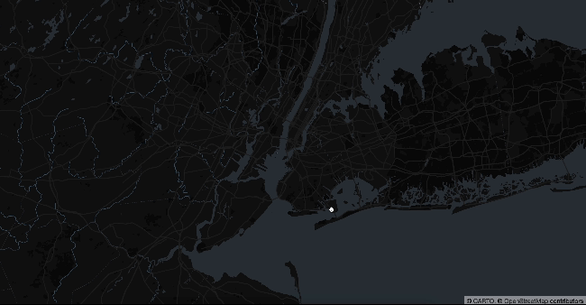

# Module 02: Adding controllers to Deck.GL

## Add controller state

```javascript
const CONTROLLER_STATE = {
  scrollZoom: true,
  dragPan: true,
  doubleClickZoom: true,
  dragRotate: true,
};
```

Learn more about controller from [here](https://deck.gl/docs/api-reference/core/controller#options)

## Add `props` to all the component (replace ADD_PROPS) to the value

```javascript
<DeckGL initialViewState={INITIAL_VIEW_STATE} controller={CONTROLLER_STATE}>
  <Map mapStyle={MAP_DARK_STYLE}></Map>
</DeckGL>
```

## Result

Your page should look something like this:

