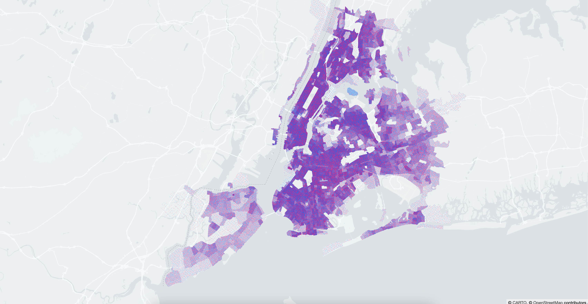

# Module 03: Visualizing data on Deck.GL

## Add `ScatterplotLayer` import

```javascript
import { ScatterplotLayer } from 'deck.gl';
```

## Add `DATA_URL` from enums

```javascript
import { DATA_URL, MAP_LIGHT_STYLE } from '../src/enums';
```

## Initialize `ScatterpoltLayer`

```javascript
const layer = new ScatterplotLayer({
  id: 'scatter-plot-layer',
  data: DATA_URL['us-census'],
  getPosition: data => [data[0], data[1], 0],
  getFillColor: data => (data[2] === 1 ? [0, 128, 255] : [255, 0, 128]),
  radiusScale: 15,
  radiusMinPixels: 0.25,
});
```

`ScatterplotLayer` expects an object with the following properties: - https://deck.gl/docs/api-reference/layers/scatterplot-layer#properties

## Add `props` to all the component (replace ADD_PROPS) to the value

```javascript
<DeckGL
  layers={layer}
  initialViewState={INITIAL_VIEW_STATE}
  controller={CONTROLLER_STATE}
>
```

\

## Result

Your page should look something like this:

