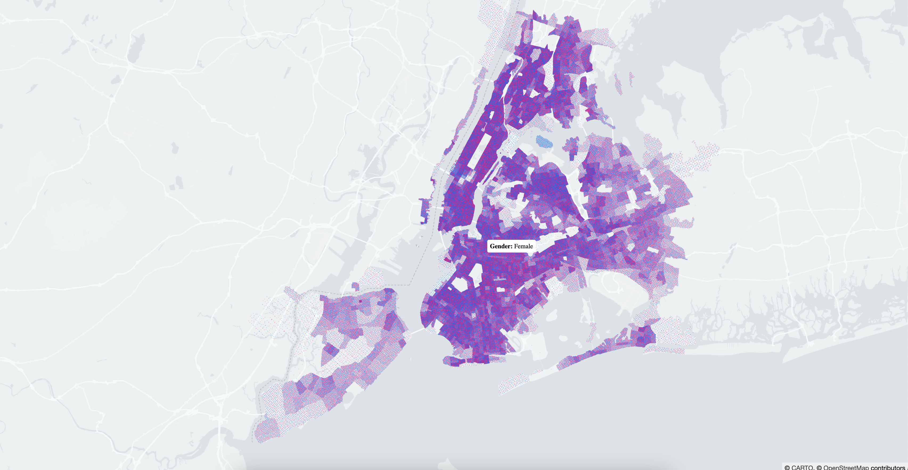

# Module 05: Adding tooltip to points

## Initialize a hoverInfo state

```javascript
const [hoverInfo, setHoverInfo] = useState(null);
```

## Init event change function

```javascript
onHover: info => {
  setHoverInfo(info);
};
```

## Add tooltip component

```javascript
{
  hoverInfo && hoverInfo.object && (
    <div style={{ left: hoverInfo.x, top: hoverInfo.y }} className="tooltip">
      <strong>Gender:</strong> {hoverInfo.object[2] === 1 ? 'Male' : 'Female'}
    </div>
  );
}
```

## Add tooltip component CSS

```css
.tooltip {
  font-size: 12px;
  position: absolute;
  pointer-events: none;
  z-index: 1;
  background: white;
  padding: 5px;
  border-radius: 3px;
}
```

## Result

Your page should look something like this:

