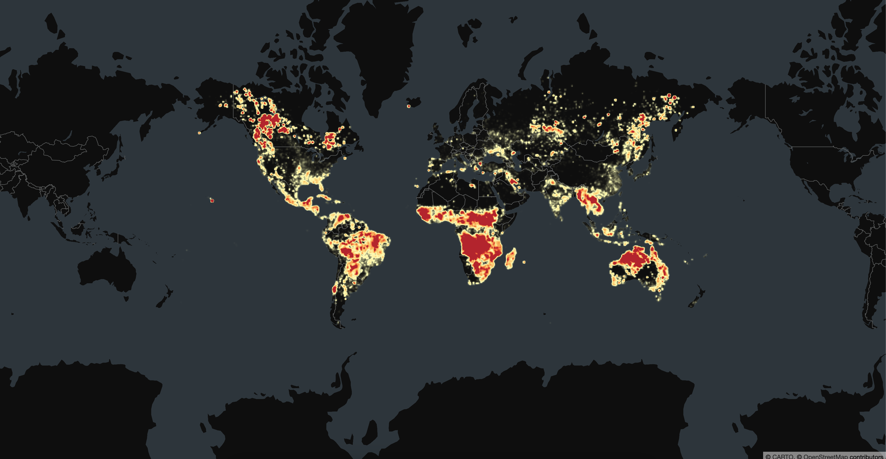

# Module 07: Heatmap with 4 million data points

## Add `HeatmapLayer` import

```javascript
import { HeatmapLayer } from 'deck.gl';
```

## Initialize `HeatmapLayer`

```javascript
const layer = new HeatmapLayer({
  id: 'heatmap-layer',
  data: DATA_URL['frp'],
  getPosition: data => [data[0], data[1], 0],
  getWeight: data => data[2],
  radiusPixels: 5,
  intensity: 20,
  threshold: 0.09,
});
```

`HeatmapLayer` expects an object with the following properties: - https://deck.gl/docs/api-reference/aggregation-layers/heatmap-layer#properties

## Result

Your page should look something like this:

