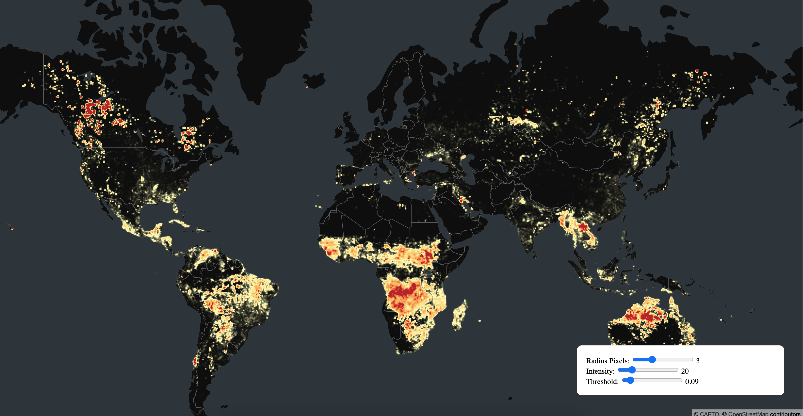

# Module 08: Heatmap with dynamic controller

## Initialize state for `radiusPixels`, `intensity`, `threshold` and `layer`

```javascript
const [radiusPixels, setRadiusPixels] = useState(3);
const [intensity, setIntensity] = useState(20);
const [threshold, setThreshold] = useState(0.09);
const [layer, setLayer] = useState(null);
```

## Set `layer` inside `useEffect`

```javascript
setLayer(
  new HeatmapLayer({
    id: 'heatmap-layer',
    data: DATA_URL['frp'],
    getPosition: data => [data[0], data[1], 0],
    getWeight: data => data[2],
    radiusPixels,
    intensity,
    threshold,
  })
);
```

## Add dependency to `useEffect`

```javascript
useEffect(() => {
  // TODO: Set layer inside `useEffect`
}, [radiusPixels, intensity, threshold]);
```

## Add Controller component

```javascript
<Controller
  controllers={[
    {
      name: 'Radius Pixels',
      value: radiusPixels,
      set: setRadiusPixels,
      max: 10,
      min: 0,
      step: 1,
    },
    {
      name: 'Intensity',
      value: intensity,
      set: setIntensity,
      max: 100,
      min: 0,
      step: 2,
    },
    {
      name: 'Threshold',
      value: threshold,
      set: setThreshold,
      max: 1,
      min: 0,
      step: 0.01,
    },
  ]}
/>
```

## Result

Your page should look something like this:

